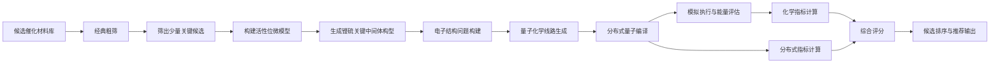
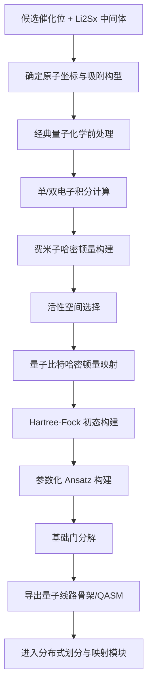
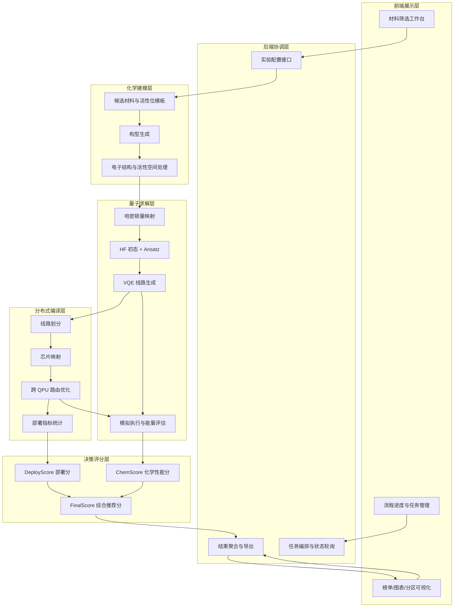

# 量智硫光核心流程图

本文档整理“量智硫光”项目当前最关键的三张图：

1. 项目总流程图
2. 化学到量子的转换流程图
3. 系统总体架构图

可直接用于方案讨论、答辩梳理和后续 PPT 绘制。

## 一、项目总流程图

### 图示说明

这张图回答的是“项目最终怎么得到筛选结果”。

核心逻辑不是直接用分布式系统筛材料，而是：

1. 先用经典方法缩小候选范围。
2. 再对关键候选做量子化学建模和分布式量子精修。
3. 最终融合化学结果和分布式部署结果完成推荐。

## 二、化学到量子的转换流程图

### 图示说明

这张图回答的是“化学问题到底如何变成量子线路”。

最重要的几点是：

1. 输入不是材料名字，而是具体微模型和原子构型。
2. 真正进入量子系统之前，先要经过电子结构建模和活性空间裁剪。
3. 分布式系统接收的不是化学方程式，而是已经分解好的量子线路骨架。

## 三、系统总体架构图

### 图示说明

这张图回答的是“系统里每一层各自负责什么”。

其中有两个关键关系需要强调：

1. 分布式编译层不是单独的求解器，它负责部署和优化。
2. 真正的筛选结果来自“化学性能分 + 分布式部署分”的联合决策。

## 四、答辩时的推荐讲法

如果你要在答辩中讲这三张图，建议按下面顺序展开：

1. 先讲项目总流程图，说明为什么项目能输出真正的材料筛选结果。
2. 再讲化学到量子的转换流程图，说明系统不是黑箱，化学问题怎样被严格转换为量子计算任务。
3. 最后讲系统总体架构图，突出你们现有分布式量子编译系统在整个平台中的核心作用。

## 五、后续可扩展图

如果后续需要，我可以继续补下面几类图：

1. 综合评分机制图
2. 挑战杯答辩专用简化版总图
3. 前端页面信息架构图
4. 分布式量子编译子流程图
